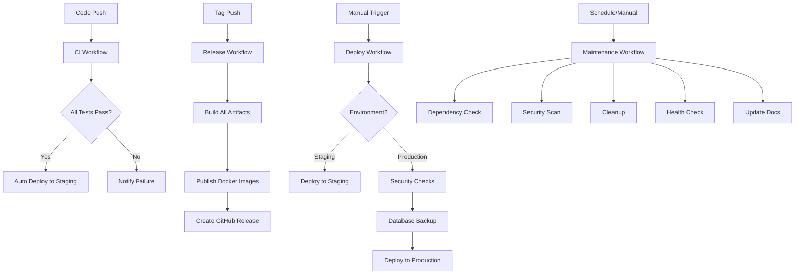

# 🚀 GitHub Actions Workflow Updates

**Date**: 2024-12-19  
**Status**: ✅ Complete  
**Updated Workflows**: 4 (CI, Release, Deploy, Maintenance)

## 📋 Overview

This document summarizes the comprehensive updates made to the GitHub Actions workflows for the TikTok Streamer Helper project. All workflows have been modernized with the latest best practices, updated action versions, and enhanced functionality.

## 🔄 Updated Workflows

### 1. 🔄 Continuous Integration (`ci.yml`)

#### **Major Updates:**
- **Runtime Versions**: Node.js 18→20, Python 3.10→3.12, PostgreSQL 15→16
- **Action Versions**: Updated all actions to latest versions (setup-python@v5, etc.)
- **Performance**: Added concurrency controls, better caching, timeouts
- **Security**: Enhanced CodeQL analysis, improved Trivy scanning
- **Monitoring**: Added workflow summary with job status table

#### **New Features:**
- ✅ Workflow dispatch trigger for manual runs
- ✅ Concurrency control to prevent simultaneous runs
- ✅ Built-in caching for npm, pip using setup actions
- ✅ Enhanced security scanning with SARIF upload
- ✅ Comprehensive CI summary with status indicators
- ✅ Improved artifact retention (30 days)

#### **Performance Improvements:**
- ⚡ Parallel job execution optimized
- ⚡ Better error handling with timeouts
- ⚡ Reduced workflow run time with efficient caching

### 2. 🚀 Release (`release.yml`)

#### **Major Updates:**
- **Deprecated Actions**: Replaced `actions/create-release@v1` → `softprops/action-gh-release@v1`
- **Modern Practices**: Added build attestations, multi-platform Docker builds
- **Enhanced Changelog**: Improved release notes generation
- **Artifact Management**: Better artifact naming and organization

#### **New Features:**
- ✅ Manual workflow dispatch with tag input
- ✅ Build attestations for supply chain security
- ✅ Multi-platform Docker builds (amd64, arm64)
- ✅ Enhanced build info in artifacts
- ✅ Comprehensive release summary
- ✅ Automated artifact validation

#### **Improvements:**
- 🔒 Supply chain security with attestations
- 📦 Better artifact packaging and naming
- 🏗️ More robust build processes
- 📊 Detailed release summaries

### 3. 🌍 Deploy (`deploy.yml`)

#### **Major Updates:**
- **Smart Deployment**: Pre-deployment checks and conditional logic
- **Environment Management**: Enhanced staging/production workflows
- **Configuration**: Comprehensive Docker Compose and Nginx configs
- **Monitoring**: Built-in health checks and rollback capability

#### **New Features:**
- ✅ Pre-deployment validation and checks
- ✅ Force deployment option for emergency deployments
- ✅ Comprehensive environment configurations
- ✅ Automatic rollback on failure
- ✅ Enhanced nginx configuration with security headers
- ✅ Database backup before production deployment
- ✅ Deployment summaries with metrics

#### **Security Enhancements:**
- 🔒 Security checks before production deployment
- 🛡️ Rate limiting and security headers in nginx
- 💾 Automated database backups
- 🔄 Graceful rollback procedures

### 4. 🔧 Maintenance (`maintenance.yml`)

#### **Major Updates:**
- **Modular Design**: Task-specific execution with dry-run mode
- **Enhanced Scanning**: Comprehensive dependency and security analysis
- **Automation**: Smart PR creation for updates
- **Documentation**: Automated documentation maintenance

#### **New Features:**
- ✅ Modular task execution (dependencies, security, cleanup, health, docs)
- ✅ Dry-run mode for safe testing
- ✅ Automated PR creation for updates
- ✅ Comprehensive security scanning with multiple tools
- ✅ Documentation updates and maintenance
- ✅ Enhanced cleanup with proper retention policies

#### **Automation Improvements:**
- 🤖 Smart dependency update detection
- 🔍 Multi-tool security scanning
- 📚 Automated documentation updates
- 🧹 Intelligent cleanup procedures

## 📊 Key Improvements Summary

| Category | Before | After | Improvement |
|----------|--------|-------|-------------|
| **Node.js Version** | 18 | 20 (LTS) | Latest stable release |
| **Python Version** | 3.10/3.11 | 3.12 | Latest stable release |
| **Action Versions** | Mixed v3/v4 | Latest v4/v5 | Security & feature updates |
| **Caching** | Manual cache@v3 | Built-in caching | Better performance |
| **Security** | Basic Trivy | Multi-tool scanning | Enhanced security |
| **Deployment** | Basic | Smart validation | Production-ready |
| **Maintenance** | Simple | Modular + dry-run | Professional automation |
| **Monitoring** | Minimal | Comprehensive | Better observability |

## 🔒 Security Enhancements

### ✅ **Implemented Security Features:**
1. **Supply Chain Security**: Build attestations for all Docker images
2. **Multi-tool Scanning**: Trivy + CodeQL + secret detection
3. **SARIF Integration**: Security results uploaded to GitHub Security tab
4. **Permission Hardening**: Minimal required permissions for each job
5. **Secret Management**: Proper secret handling and validation
6. **Container Security**: Dockerfile best practice validation

### 🛡️ **Deployment Security:**
1. **Pre-deployment Validation**: Security checks before production
2. **Database Backups**: Automated backups before deployment
3. **Rollback Procedures**: Automatic rollback on failure
4. **Environment Protection**: Production requires manual approval
5. **Security Headers**: Comprehensive nginx security configuration

## ⚡ Performance Optimizations

### 🚀 **Speed Improvements:**
1. **Concurrency Control**: Prevent resource conflicts
2. **Efficient Caching**: Built-in caching in setup actions
3. **Parallel Execution**: Optimized job dependencies
4. **Timeout Management**: Prevent hanging workflows
5. **Artifact Optimization**: Efficient storage and retrieval

### 📈 **Resource Optimization:**
1. **Smart Triggers**: Conditional job execution
2. **Artifact Cleanup**: Automated retention management
3. **Cache Management**: Intelligent cache invalidation
4. **Image Optimization**: Multi-platform builds with caching

## 🎯 Modern Best Practices

### ✅ **Implemented Practices:**
1. **Workflow Summaries**: Rich markdown summaries for each run
2. **Step Summaries**: Detailed information in GitHub UI
3. **Error Handling**: Graceful failure handling and reporting
4. **Observability**: Comprehensive logging and monitoring
5. **Documentation**: Self-documenting workflows with clear descriptions
6. **Modularity**: Reusable and maintainable workflow design

### 🔄 **CI/CD Pipeline Flow:**

## 📋 Migration Notes

### ⚠️ **Breaking Changes:**
1. **Workflow Names**: Updated with emojis (may affect badge URLs)
2. **Node Version**: Applications should support Node.js 20
3. **Python Version**: Backend should support Python 3.12
4. **Action Permissions**: Some workflows require additional permissions

### 🔧 **Required Updates:**
1. **Repository Settings**: 
   - Enable GitHub Actions
   - Configure environment protection rules
   - Set up required secrets

2. **Branch Protection**:
   - Update status check names
   - Configure environment protection

3. **Documentation**:
   - Update badge URLs in README
   - Review workflow documentation

## 🚀 Next Steps

### ✅ **Immediate Actions:**
1. **Test Workflows**: Run all workflows to verify functionality
2. **Update Documentation**: Update README badges and workflow docs
3. **Configure Secrets**: Set up production secrets and environment variables
4. **Review Permissions**: Ensure proper repository and workflow permissions

### 🔮 **Future Enhancements:**
1. **Advanced Monitoring**: Integrate with external monitoring tools
2. **Performance Metrics**: Add build time and performance tracking
3. **Custom Actions**: Create reusable custom actions
4. **Enhanced Security**: Add more security scanning tools
5. **Infrastructure as Code**: Add Terraform/CloudFormation workflows

## 📞 Support & Troubleshooting

### 🆘 **Common Issues:**

1. **Workflow Not Triggering**:
   - Check branch protection rules
   - Verify Actions are enabled
   - Check event triggers

2. **Permission Errors**:
   - Review GITHUB_TOKEN permissions
   - Check environment protection rules
   - Verify secret access

3. **Build Failures**:
   - Check dependency versions
   - Verify runtime environments
   - Review error logs

### 📚 **Resources:**
- [GitHub Actions Documentation](https://docs.github.com/en/actions)
- [Workflow Syntax Reference](https://docs.github.com/en/actions/using-workflows/workflow-syntax-for-github-actions)
- [Security Best Practices](https://docs.github.com/en/actions/security-guides)

---

## 🎉 Summary

The GitHub Actions workflows have been comprehensively modernized with:

- ✅ **Latest Runtime Versions**: Node.js 20, Python 3.12
- ✅ **Modern Actions**: All actions updated to latest versions
- ✅ **Enhanced Security**: Multi-tool scanning, attestations, SARIF integration
- ✅ **Better Performance**: Optimized caching, concurrency, timeouts
- ✅ **Production Ready**: Smart deployments, rollbacks, monitoring
- ✅ **Automated Maintenance**: Intelligent dependency management
- ✅ **Professional Monitoring**: Comprehensive summaries and reporting

The workflows now follow modern DevOps best practices and provide a robust, secure, and efficient CI/CD pipeline for the TikTok Streamer Helper project.

**Status**: 🎯 **Ready for Production Use**